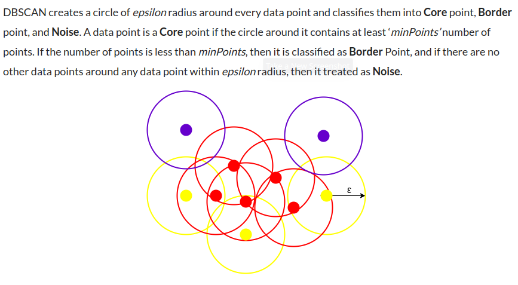

The above figure shows us a cluster created by DBCAN with minPoints = 3. Here, we draw a circle of equal radius epsilon around every data point. These two parameters help in creating spatial clusters.   
  

All the data points with at least 3 points in the circle including itself are considered as Core points represented by red color. All the data points with less than 3 but greater than 1 point in the circle including itself are considered as Border points. They are represented by yellow color. Finally, data points with no point other than itself present inside the circle are considered as Noise represented by the purple color.  

For locating data points in space, DBSCAN uses Euclidean distance, although other methods can also be used (like great circle distance for geographical data). It also needs to scan through the entire dataset once, whereas in other algorithms we have to do it multiple times.

# parameter Selection in DBSCAN Clustering

DBSCAN is very sensitive to the values of epsilon and minPoints. Therefore, it is very important to understand how to select the values of epsilon and minPoints. A slight variation in these values can significantly change the results produced by the DBSCAN algorithm.

The value of minPoints should be at least one greater than the number of dimensions of the dataset, i.e., 

minPoints>=Dimensions+1.

It does not make sense to take minPoints as 1 because it will result in each point being a separate cluster. Therefore, it must be at least 3. Generally, it is twice the dimensions. But domain knowledge also decides its value.

The value of epsilon can be decided from the K-distance graph. The point of maximum curvature (elbow) in this graph tells us about the value of epsilon. If the value of epsilon chosen is too small then a higher number of clusters will be created, and more data points will be taken as noise. Whereas, if chosen too big then various small clusters will merge into a big cluster, and we will lose details.