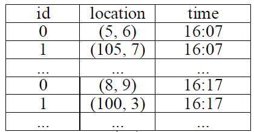
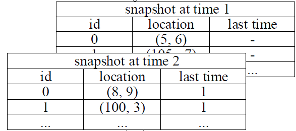
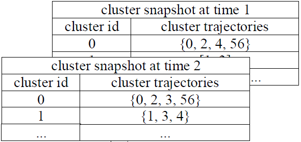

 # الگوی همروندی چیست؟    
    • تعریف داده­ سیر: عبارت است از o = r1, r2, r3, …, rn به صورتی که r = (l, t) و l نمایشگر موقعیت جغرافیایی و t نمایشگر زمان است.    
    • تعریف دنباله های زمانی: گسسته‌سازی، زمان‌ واقعی را به شاخص‌های بازه‌ ای زمانی که طی آن رخ داده‌اند نگاشت میکنند .
    به عنوان مثال: اگر بازه رخ­داد ها 5 ثانیه باشد و زمان شروع 13:00:20  باشد، سری زمانی زیر به صورت مقابل از راست به چپ گسسته میشود   :
    سری زمانی : 13:00:21 – 13:00:24 – 13:00:28 – 13:00:32 – 13:00:42 
    گسسته : 0 – 0 – 1 – 2 – 4   
    
**بر این اساس بازه زمانی را نمیتوان بسیار بزرگ یا کوچک قرار داد . ما در آزمایش های خود بین 1 تا 5 قرار میدهیم**

    ◦ مشکلات :   
        ▪ صفر چند بار رخ میدهد.  
        ▪ شکاف گراه کننده دارد.  
      
    
# تعریف L-توالی:    
 
   اگر به ازای تمام تمامی دنباله های زمانی، طول هیچ دنباله ای کمتر از L نباشد، آن دنباله زمانی L-توالی است. به عنوان مثال اگر T = 1, 2, 4, 5, 6 یک دنباله زمانی باشد، این دنباله شامل دو قسمت است، T1 = 1, 2 و T2 = 4,5,6 در این دو قسمت طول هر دو بزرگ تر از 2 است بنابراین دنباله اصلی 2-توالی میباشد.  

# تعریف G-اتصال:    
    
 عبارت است ازحداکثر شکاف بین دو دنباله. به عنوان مثال اگر T = 1, 2, 4, 5, 6 یک دنباله زمانی باشد، این دنباله شامل دو قسمت است، T1 = 1, 2 و T2 = 4,5,6، حداکثر شکاف بین این دو دنباله 2 است، بنابراین این دنباله 2-اتصال است.      
    

    تعریف الگوی همروندی: اگر ST دیتابیس داده های سیر ما باشد، مجموعه O از ST یک الگوی همروندی است، CP(M, K, L, G) اگر توالی زمانی T به نحوی باشد که 5 شرط ارضاشوند.   
    
     1- تمام اشیاء موجود در مجموعه O در تمامی زمان های T متعلق به یک خوشه باشند(نزدیکی).    
     2- طول O بزرگ تر مساوی با M باشد.    
     3- طول زمان T بزرگ تر مساوی با K باشد.
     4- T، L-توالی باشد    
     5- T، G-اتصال باشد.      

# نگاهی بر چهارچوب تشخیص الگوهای همروند:    

چهارچوب ICPE (Indexed Clustering and Pattern Enumeration) داده های خط­سیر ورودی را دریافت کرده و گام های زیر را برروی داده ها انجام میدهد:

### داده ورودی:   
   
   
### گام اول:   
   

### گام دوم:   
   

### گام سوم:    
   